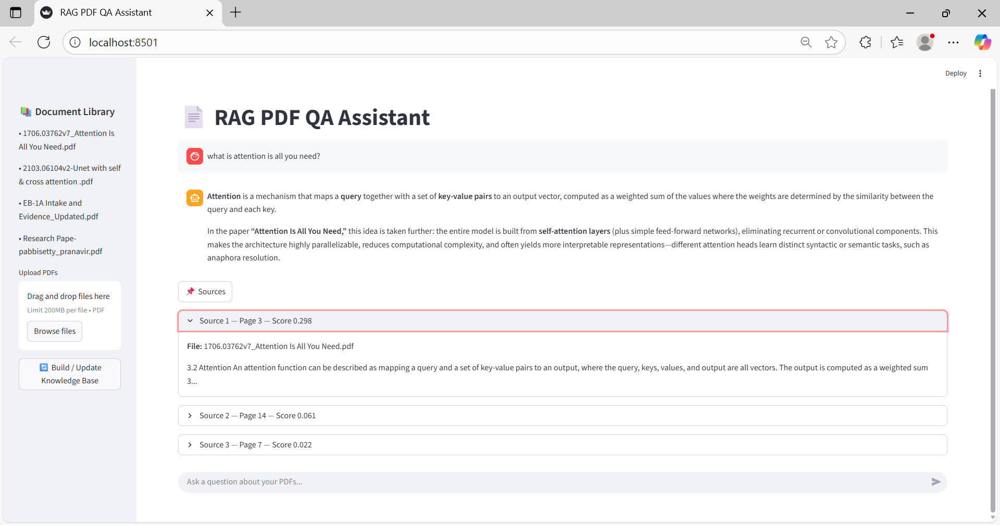
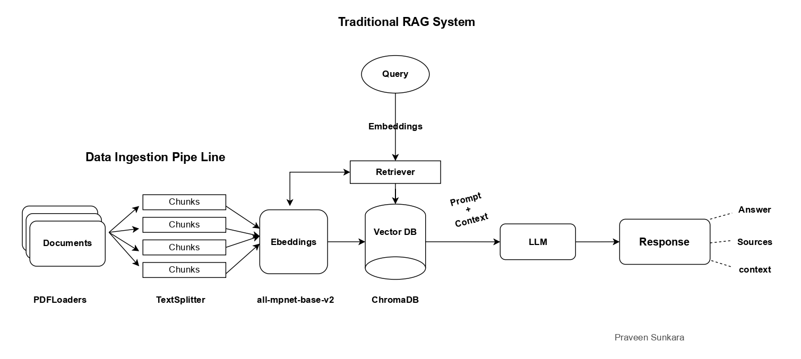

# RAG - Retrieval-Augmented Generation Application

* Persionalized RAG for query retrievals.
* Quick Q/A with the given knowledge bases.

---

# Demo Images:
<p align="center">
  
</p>


## Tech stack

Libraries  used to get done the project:
```
PDFLoader - to purse the data
TextSplit(RecursiveCharacterTextSplitter) - to split the text into chunks
sentence-transformers(all-mpnet-base-v2) - Embedding the chunks
ChromaDB - to store the Embedding Vectors
Groq-LLM(openai/gpt-oss-120b) - to summarize the context along with the prompt
```
---

# Workflow of the RAG Pipeline
<p align="center">
  
</p>

# Project setup Locally:
Go to Terminal or bash of you project folder:

```
git clone https://github.com/praveensunkara19/RAG.git

cd RAG

python -m venv myenv 

myenv/scripts/activate

pip install -r requirements.txt

streamlit run app.py
```

#Future scope:
* Adding persionlization like speech
* Retrieval of images 
* Industry level optimization using for better retrieval with - FAISS, PineCone
* Works with all document types.
